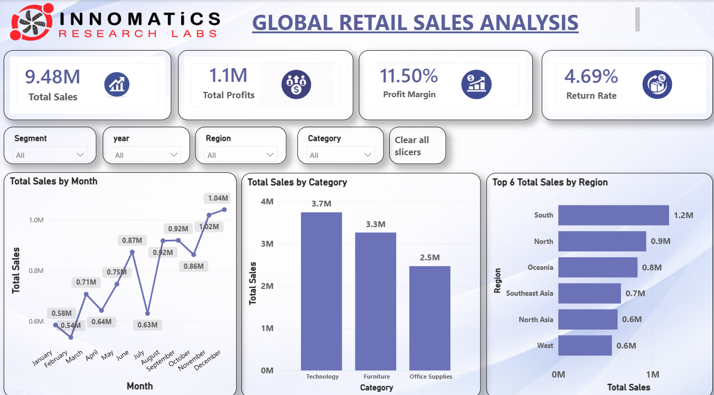
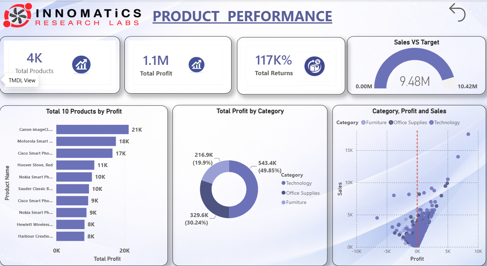
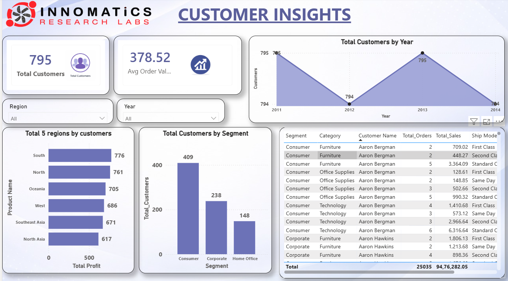

# 📊 Global Superstore Sales Dashboard (Power BI)

## 📌 Project Overview

This project presents an interactive Power BI dashboard built using the Global Superstore dataset. It provides business insights into sales, profit, customers, shipping performance, and regional trends.

---

## 🚀 Features

- 📈 Sales Dashboard
- 💰 Profit Analysis
- 🌍 Regional Performance
- 📦 Product Category Analysis
- 👥 Customer Insights
- 🚚 Shipping Mode Analysis
- 📊 Interactive Filters & Slicers
- 📅 Year-wise and Month-wise Trends

---

## 🛠️ Tools Used

- Power BI
- Power Query
- DAX
- Microsoft Excel / CSV

---

## 📂 Dataset

- Orders.csv
- People.csv
- Returns.csv

---

## 📷 Dashboard Preview

### Overview



### Profit Analysis



### Sales Analysis



---

## 📈 Key Insights

- Identified top-performing regions.
- Analyzed profit trends across categories.
- Monitored customer purchasing behavior.
- Compared shipping modes.
- Built interactive KPI dashboards.

---

## 📁 Project Structure

```
PowerBI_Project.pbix
Dashboard_Overview.png
Dashboard_Profit.png
Dashboard_Sales.png
README.md
data/
```

---

## 👨‍💻 Author

**Chandu Dasari**

- GitHub: https://github.com/dasarichandu2309
- LinkedIn: https://www.linkedin.com/in/dasari-chandu-4374022b6